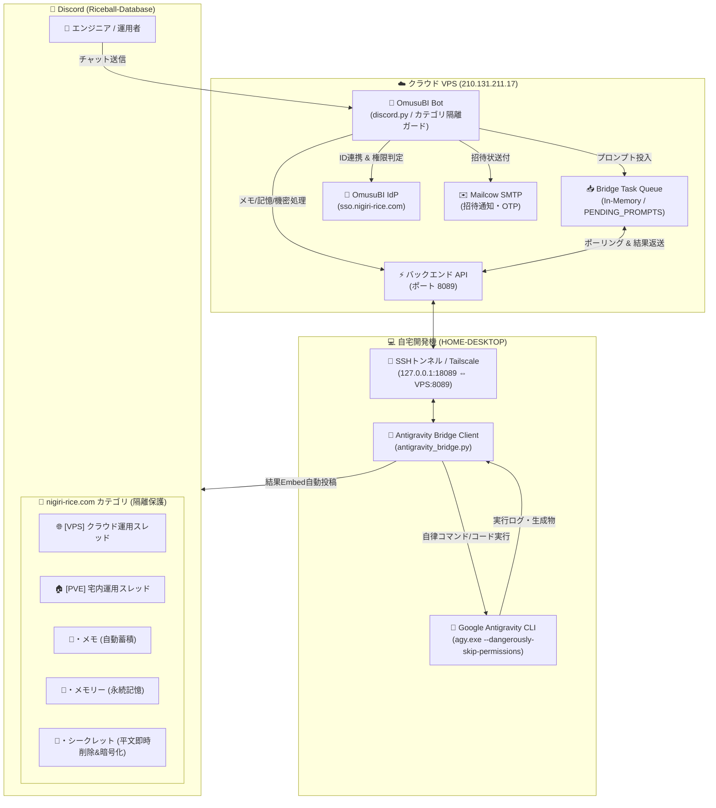

# 🍙 OmusuBI Discord Connecter & Antigravity Remote Bridge

[](https://opensource.org/licenses/MIT)
[](https://www.python.org/)
[](https://fastapi.tiangolo.com/)
[](https://discordpy.readthedocs.io/)
[](https://www.keycloak.org/)
[](https://antigravity.google.com/)

**OmusuBI Discord Connecter** は、全社認証統合基盤 **OmusuBI (Keycloak 24+)** と **Discord** を直結し、組織のアイデンティティ統治、自動オンボーディング、そして **外出先 Discord から自宅開発機（HOME-DESKTOP）の自律AIエージェント（Antigravity）を遠隔操作する双方向ブリッジ** を提供する総合運用支援システムです。

---

## 🏛️ 全体アーキテクチャ



---

## ✨ 主要機能

### 1. 🚀 Antigravity Remote Bridge (自宅PC AI遠隔操作)
- **Discord から自宅PCのAIを動かす**:
  - 外出先のスマホや別端末の Discord からスレッド・チャンネルで指示文を送るだけで、自宅PC（HOME-DESKTOP）上で常駐する Google Antigravity エージェント（`agy.exe`）が起動。
  - ファイルの閲覧・編集、シェルコマンドの実行、テスト実行などを自律的に行い、その完了ログ・ターミナル出力をリアルタイムに Discord スレッドへ Embed 返信します。
- **セキュア通信**:
  - SSH 暗号化ポートフォワーディング（または Tailscale メッシュネットワーク）経由で通信するため、自宅ルーターのポート開放は一切不要。
- **PC側ワンクリック起動**:
  - `bridge/start_bridge.bat` をダブルクリックするだけで、トンネル確立とタスク監視が自動起動します。

### 2. 💬 スラッシュコマンド不要のインテリジェント通常送信
コマンド（`/ask` や `/memo` 等）を入力することなく、チャンネルの目的に応じて通常メッセージを自動認識・自動処理します：

- **`📝・メモ` チャンネル**:
  - 通常送信したテキストを開発メモとして自動記録。
- **`🧠・メモリー` チャンネル**:
  - システム知識、IP割り当てルール、設計思想を永続記憶ストア（`memory.json`）へ自動保存。
- **`🔐・シークレット` チャンネル**:
  - パスワードやAPIキーを送信すると、**送信されたDiscordの平文メッセージが即座に自動物理削除**され、暗号化されて安全に保管（照会時はマスク表示）。
- **`🌐 [VPS]` / `🏠 [PVE]` 専任スレッド**:
  - 運用プロンプト送信により、PC Antigravity への自動ディスパッチ、または VPS/クラスターリアルタイム稼働診断を即時返信。

### 3. 🛡️ カテゴリ隔離ガード (Category Isolation Guard)
- 指定された専用カテゴリ（`1555216452267544676`）以外のチャンネルには一切反応・発言・干渉しない安全ガードを実装。
- 誤動作や情報漏洩を物理的レイヤーで完全に防ぎます。

### 4. 🔑 OmusuBI SSO / Keycloak リアルタイムID統治
- **ロール自動プロビジョニング / デプロビジョニング**:
  - Discord サーバーの参加状態や特定チャンネルの閲覧権限（`ViewChannel`）を監視。
  - 条件を満たしたユーザーに Keycloak 側の `Developer` ロールを自動付与。
  - チャンネル閲覧権限喪失やサーバー脱退（`on_member_remove`）時は、Keycloak ロールを即時自動剥奪。
- **自動オンボーディング・一括招待**:
  - Keycloak で Developer ロールを持ちながら Discord 未参加のユーザーを自動検知し、Discord DM および Mailcow 経由の HTML 招待メールを配信。

---

## 📂 ディレクトリ構成

```text
.
├── bot/
│   └── discord_bot.py           # Discord Bot 本体 (イベントハンドラ & スラッシュコマンド)
├── bridge/
│   ├── antigravity_bridge.py    # 自宅PC常駐ブリッジクライアント (SSHトンネル自動確立 & agy実行)
│   ├── start_bridge.bat         # 自宅PC用ワンクリック起動バッチ
│   └── GEMINI.md                # AIエージェント永久運用ルール (Discord自動報告義務)
├── k8s/
│   └── deployment.yaml          # Kubernetes (k3s) デプロイマニフェスト
├── services/
│   ├── dev_chat_service.py      # プロンプトルーティング・ブリッジキュー・メモ/記憶管理
│   ├── discord_service.py       # Discord API 連携・権限判定
│   ├── invitation_service.py    # DM & SMTP 招待通知配信
│   └── keycloak_service.py     # Keycloak Admin REST API 連携
├── web/
│   ├── app.py                   # FastAPI バックエンド & ブリッジAPI (/poll, /result, /dispatch)
│   ├── auth.py                  # SSO セッション管理
│   ├── static/                  # WebUI 静的アセット
│   └── templates/               # WebUI Jinja2 テンプレート
├── config.py                    # 設定マネージャー (環境変数 & Secrets管理)
├── main.py                      # サービスエントリーポイント (FastAPI + Bot 同時起動)
├── requirements.txt             # Python 依存関係
├── Dockerfile                   # コンテナビルド定義
├── .env.example                 # 環境変数サンプル設定
└── README.md                    # 本ドキュメント
```

---

## 🚀 クイックスタート

### 1. 前提条件
- Python 3.11 以上
- Discord Bot アプリケーション（Privileged Gateway Intents 有効化）
- Keycloak 24+（Admin REST API 利用可能）
- 自宅PC: Google Antigravity CLI (`agy`) インストール済み

### 2. 環境変数設定
`.env.example` をコピーして設定ファイルを作成します：

```bash
cp .env.example .env
# .env を編集して各環境の値を設定
```

### 3. VPS（サーバー）側の起動

#### ローカル / systemd での実行:
```bash
python -m venv venv
source venv/bin/activate
pip install -r requirements.txt
python main.py
```

#### Docker での実行:
```bash
docker build -t omusubi-discord-connecter:latest .
docker run -d -p 8089:8089 --env-file .env --name omusubi-discord-connecter omusubi-discord-connecter:latest
```

### 4. 自宅PC（ブリッジクライアント）の起動
自宅PC（Windows）で `bridge/start_bridge.bat` を実行します：

```cmd
cd bridge
start_bridge.bat
```

起動後、VPS との SSH ポートフォワーディングが自動確立され、Discord からのプロンプト受信待機状態になります。

---

## 📡 ブリッジ API 仕様

| エンドポイント | メソッド | 説明 |
|---|---|---|
| `/health` | `GET` | サービスの稼働ヘルスチェック |
| `/api/bridge/poll` | `GET` | 自宅PCブリッジがタスクを取得するためのロングポーリング |
| `/api/bridge/result` | `POST` | 自宅PC Antigravity の実行結果を送信し Discord に返信 |
| `/api/bridge/dispatch`| `POST` | WebAPI や外部スクリプトから PC Antigravity へタスクを投入 |

---

## 🔒 セキュリティ設計

1. **ゼロ・ポートフォワーディング**:
   - 自宅PC側に外部向けリッスンポートを開放せず、PCから VPS への一方向 SSH トンネル（または Tailscale）のみで通信。
2. **機密情報の即時抹消**:
   - `🔐・シークレット` チャンネルへの送信メッセージは、Bot がメモリ内に取り込んだ瞬間に Discord API 経由で平文メッセージを自動抹消。
3. **カテゴリ隔離**:
   - 許可された開発カテゴリ ID 以外へのアクセス・応答をコードレベルで拒絶。
4. **Credential サニタイズ**:
   - コードベース内に平文トークン・パスワードを含めず、環境変数および安全なシークレットストアからロード。

---

## 📄 ライセンス

本プロジェクトは [MIT License](LICENSE) の下で公開されています。
Copyright (c) 2026 nigiri-rice.com / Riceball@0427.
